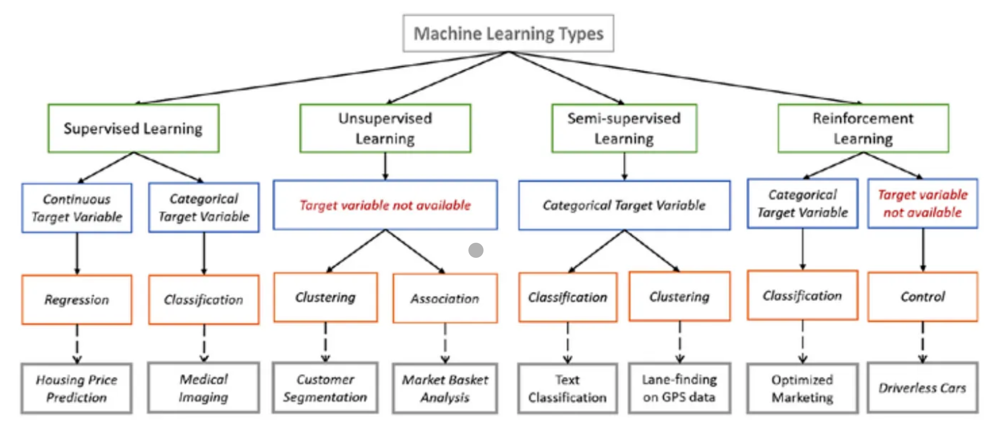

# Introduction to AI in Materials Science

## Artificial Intelligence (AI) is a general term covering various subfields, including:
1.  **Machine Learning (ML):** Focuses on algorithms that enable computers to learn from data.
2. **Neural Networks (NNs):** Fundamental in many ML models, inspired by the human brain's structure.
3. **Large Language Models (LLMs):** A specific application of NNs. Excel in understanding and generating human-like language, e.g., GPT-3.
    
### Common misunderstandings about AI:
1. **All-powerful solution:** AI can't solve every problem; it's task-specific.
2. **Human-like intelligence:** AI lacks general intelligence comparable to humans.
3. **Unbiased objectivity:** AI inherits biases from training data.
4. **Human-like understanding:** AI lacks true comprehension or consciousness.
Addressing these misconceptions is crucial for a realistic understanding of AI's capabilities and limitations.

### In general, AI offers several benefits in materials research, such as:
- **Accelerated Discovery:** AI can analyze datasets and identify patterns, accelerating the discovery of new materials with desirable properties.
- **Optimization:** ML algorithms can optimize material properties by predicting how different parameters affect desired properties, guiding researchers in their experiments.
- **Cost and Time Savings:** AI can reduce the time and cost associated with experimental research by suggesting promising experiments, minimizing trial and error.
We will be learning about 3 different subfields in AI, namely, LLMS, ML and NNs.
LLMS models like GPT can be useful in analyzing experimental data by:
- **Data Interpretation:** They can assist in interpreting complex experimental results, extracting key insights, and generating human-readable summaries.
- **Contextual Understanding:** Language models can understand the context of scientific literature, helping researchers relate their experimental findings to existing knowledge.
- **Data Integration:** These models can integrate information from diverse sources, aiding researchers in connecting different aspects of experimental data and forming a comprehensive understanding.
- **Hypothesis Generation:** Language models can suggest hypotheses based on existing data, facilitating the generation of new ideas for further experimentation.
In essence, LLMS can act as intelligent assistants, aiding researchers in navigating and extracting valuable information from the vast amount (millions or billions) of data generated in materials research.

---
## LLMs
GPT-3 (Generative Pre-trained Transformer 3), are AI models designed for natural language processing tasks. These models are characterized by their extensive scale, incorporating millions or even billions of parameters. Here are key features:

1. **Pre-training:** These models are pre-trained on massive datasets containing parts of the Internet, books, and various texts. During pre-training, they learn language patterns, context, and relationships.

2. **Transformer Architecture:** Large language models typically utilize the transformer architecture, which allows them to capture long-range dependencies in data effectively.

3. **Generative Capability:** They have the ability to generate coherent and contextually relevant text. Given a prompt, they can generate new content, answer questions, or complete sentences.

4. **Fine-tuning:** After pre-training, models can be fine-tuned for specific tasks or applications, making them versatile for various language-related applications like translation, summarization, and question-answering.

5. **Diverse Applications:** Large language models find applications in natural language understanding, text generation, sentiment analysis, and more. They are valuable tools for developers, researchers, and businesses in diverse industries.

---
## NNs
A neural network (NN) is a computational model inspired by the structure and functioning of the human brain. It consists of interconnected nodes, called neurons, organized in layers. The basic building block is a neuron, which receives input, processes it through an activation function, and produces an output.


Key components of a neural network:


1. **Input Layer:** Receives the initial data or features to be processed.

2. **Hidden Layers:** Intermediate layers between the input and output layers where computations take place. Each layer contains neurons that transform the input data.

3. **Output Layer:** Produces the final output based on the processed information from the hidden layers.

4. **Weights and Biases:** Parameters associated with the connections between neurons. They are adjusted during the training process to optimize the network's performance.

5. **Activation Function:** Introduces non-linearity to the model, allowing it to learn complex relationships in the data.

Neural networks are used in machine learning to perform tasks such as pattern recognition, classification, regression, and more. Deep neural networks, with multiple hidden layers, are particularly effective in capturing intricate patterns and representations in complex datasets.

—--
## ML 
Machine learning (ML) focuses on developing algorithms and models that enable computers to learn from data and make predictions or decisions without being explicitly programmed for a particular task. (Such as: solving dynamics without ever knowing newtons equation). The core idea is to allow machines to improve their performance on a specific task over time through experience.

-insert figure from https://medium.com/@codekalimi/list-of-machine-learning-models-61b51ad492f1



# Key concepts in ML:

1. **Training Data:** Algorithms are trained on large datasets, allowing them to learn patterns, correlations, and features relevant to the task at hand.

2. **Learning Algorithms:** These are the mathematical models that analyze and learn from the training data. The type of algorithm chosen depends on the nature of the problem, such as classification, regression, clustering, or reinforcement learning.

3. **Features:** Characteristics or attributes of the input data that the algorithm uses to make predictions.

4. **Supervised and Unsupervised Learning:** In supervised learning, models are trained on labeled data, where the algorithm is provided with input-output pairs. In unsupervised learning, the algorithm explores patterns in unlabeled data.

5. **Training and Inference:** During the training phase, the model learns from the data. In the inference phase, the trained model makes predictions or decisions on new, unseen data.

Machine learning is applied in various domains, including image and speech recognition, natural language processing, recommendation systems, healthcare, finance, and more. It plays a crucial role in automating tasks and extracting meaningful insights from large datasets.

---

In summary: 
- **Large Language Models (LLMs):** LLMs, like GPT-3, are a specific type of neural network architecture designed for natural language processing tasks. They are large-scale models with millions or billions of parameters and excel at understanding, generating, and processing human-like text.

- **Neural Networks (NN):** Neural networks are a broader category that includes various architectures, not limited to language processing. NNs are computational models inspired by the human brain, consisting of interconnected nodes organized in layers. They are a fundamental component of machine learning and are used for various tasks like image recognition, speech processing, and more.

 

- **Machine Learning (ML):** Machine learning is a broader field that encompasses various approaches, including neural networks. ML involves the development of algorithms and models that allow computers to learn patterns from data and make predictions or decisions without explicit programming. It includes supervised learning, unsupervised learning, reinforcement learning, and other techniques.

---

# Python's Popularity in Scientific Computing

**Overview:**
Python is a preferred choice for scientific computing due to its robustness, extensive libraries, and a supportive developer community.

**Key Reasons for Python's Popularity:**
- **Community Support:** Python’s large community continually develops scientific packages and
- **Interoperability:** Python integrates well with other languages, facilitating access to established codes.
- **Accessibility:** Being open-source, Python offers a wide array of tools without cost barriers.

**Applications in Scientific Computing:**
- **Simulation and Modeling:** Python supports computational methods vital for materials modeling and simulations.
- **Data Analysis:** Its capabilities enable efficient processing and analysis of experimental and computational data.
- **Machine Learning:** Python’s machine learning libraries aid in predictive models for materials properties.

---

## Environments
When working with Python, you have various environments for execution:

1. **Windows Powershell:** If you're using a Windows system and are familiar with Powershell, it's a powerful command-line tool that can execute Python scripts. [CLICK HERE FOR DIRECTIONS](https://github.com/JaredKeithAveritt/AI_methods_in_advanced_materials_research/blob/main/week_1/week_1/Python_Powershell.md)

2. **Mac Terminal:** For Mac users comfortable with BASH, the Terminal offers an environment to run Python code. [CLICK HERE FOR DIRECTIONS](https://github.com/JaredKeithAveritt/AI_methods_in_advanced_materials_research/blob/main/week_1/Python_Terminal.md)

3. **Linux:** Similar to Mac, Linux users can leverage their system's Terminal to execute Python scripts.  [CLICK HERE FOR DIRECTIONS](https://github.com/JaredKeithAveritt/AI_methods_in_advanced_materials_research/blob/main/week_1/Python_Linux.md)

4. **Chapel Hills Longleaf/Dogwood Cluster:** Accessing Chapel Hills Longleaf or Dogwood clusters allows for high-performance computing (HPC), but access may require a three-week process for approval and setup.  [CLICK HERE FOR DIRECTIONS](https://github.com/JaredKeithAveritt/AI_methods_in_advanced_materials_research/blob/main/week_1/Python_UNC.md)

5. **Google Colab:** Utilizing Google Colab, a cloud-based platform, requires a Google account. Colab provides a collaborative Jupyter notebook environment for executing Python code directly in a browser. [Access Google Colab here](https://colab.research.google.com/). [CLICK HERE FOR DIRECTIONS](https://github.com/JaredKeithAveritt/AI_methods_in_advanced_materials_research/blob/main/week_1/Python_Colab.md)

Each environment offers distinct advantages and is suited to different purposes. Throughout this tutorial series, we'll explore these environments in detail, understanding their functionalities and learning how to execute Python code effectively in each of them.

For the first half of this workshop we will use google colab, if you are planing on needing to complete a research project with a large data set I recomend requesting access to Chapel Hills HPC Resources.  

---

## Python Syntax Basics Tutorial

### Variables and Assignment

In Python, variables are containers used to store data values. Here's how you assign values to variables:

```python
# Assigning values to variables
x = 5  # integer
y = 3.14  # float
name = "Alice"  # string
is_valid = True  # boolean
```

### Data Types

Python supports various data types:

- **Integers:** Whole numbers without decimals.
- **Floats:** Numbers with decimals or in exponential form.
- **Strings:** Sequence of characters enclosed in single/double quotes.
- **Booleans:** Represents True or False values.

```python
# Examples of different data types
integer_value = 10
float_value = 3.14
string_value = "Hello, Python!"
boolean_value = True
```

### Loops and Conditional Statements

#### Loops

**For Loops:** Iterate over a sequence (like a list, tuple, string, etc.).

```python
# Example of a for loop
for i in range(5):  # Loop through numbers 0 to 4
    print(i)  # Print each number
```

**While Loops:** Execute a block of code as long as the condition is True.

```python
# Example of a while loop
counter = 0
while counter < 5:
    print(counter)
    counter += 1
```

#### Conditional Statements

**If-Else Statements:** Execute different blocks of code based on conditions.

```python
# Example of if-else statement
x = 10
if x > 5:
    print("x is greater than 5")
else:
    print("x is less than or equal to 5")
```

## Functions and Libraries in Python

### Introduction to Functions

In Python, a function is a block of organized, reusable code that performs a specific task. It allows you to divide your code into manageable parts and promote reusability. Here we cover the basics of functions in Python, including defining functions, using built-in functions, an introduction to libraries, and how to use popular libraries such as `math`, `numpy`, and `pandas`.

### Defining a Function

You can define a function using the `def` keyword followed by the function name and parameters within parentheses.

```python
# Defining a simple function
def greet(name):
    print(f"Hello, {name}!")

# Calling the function
greet("Alice")
```

### Built-in Functions

Python comes with a variety of built-in functions that are readily available for use.

```python
# Using built-in functions
number_list = [3, 7, 1, 5, 9]

# Finding the length of a list
print(len(number_list))

# Finding the maximum value in a list
print(max(number_list))

# Sorting a list
sorted_list = sorted(number_list)
print(sorted_list)
```

## Libraries

### Introduction to Libraries

Libraries in Python contain pre-written code/modules that provide functionalities to perform specific tasks.

### Using Libraries

To use a library, you need to import it into your script using the `import` statement.

```python
# Importing the math library
import math

# Calculating the square root
result = math.sqrt(25)
print(result)

# Using the constant pi
print(math.pi)
``` 

### Popular Libraries

Python has numerous powerful libraries for various purposes such as NumPy for numerical computations, Pandas for data manipulation, Matplotlib for data visualization, and more. Functions are essential blocks of code for organizing tasks, while libraries provide a wide range of functionalities to accomplish diverse programming tasks in Python. Mastering functions and utilizing libraries can significantly enhance your coding efficiency and capabilities.


```python
# Using NumPy for arrays
import numpy as np

# Creating a NumPy array
my_array = np.array([1, 2, 3, 4, 5])
print(my_array)

# Using Pandas for data manipulation
import pandas as pd

# Creating a Pandas DataFrame
data = {'Name': ['Alice', 'Bob', 'Charlie'], 'Age': [25, 30, 35]}
df = pd.DataFrame(data)
print(df)
```

time is a usefull library to see how long it takes for codes to execute, so you can get an idea of the scalability of your code (if it takes too long -- there are other options, such as HPC's).

```python
import numpy as np
import time

# Function to perform matrix multiplication using NumPy
def numpy_matrix_multiply(matrix_size):
    A = np.random.rand(matrix_size, matrix_size)
    B = np.random.rand(matrix_size, matrix_size)
    start_time = time.time()
    result = np.dot(A, B)
    end_time = time.time()
    return end_time - start_time

# Function to perform matrix multiplication using Python lists
def list_matrix_multiply(matrix_size):
    A = [[np.random.rand() for _ in range(matrix_size)] for _ in range(matrix_size)]
    B = [[np.random.rand() for _ in range(matrix_size)] for _ in range(matrix_size)]
    start_time = time.time()
    result = [[sum(a * b for a, b in zip(row_a, col_b)) for col_b in zip(*B)] for row_a in A]
    end_time = time.time()
    return end_time - start_time

# Define the matrix size
matrix_size = 100

# Time NumPy matrix multiplication
numpy_time = numpy_matrix_multiply(matrix_size)
print(f"NumPy Matrix Multiplication Time: {numpy_time} seconds")

# Time Python list matrix multiplication
list_time = list_matrix_multiply(matrix_size)
print(f"Python List Matrix Multiplication Time: {list_time} seconds")

``` 


## Conclusion

Note, this is a foundational understanding of Python's syntax basics, including variables, data types, loops (for and while), conditional statements (if-else) and Functions. With these fundamental concepts, you can start writing Python code and explore more advanced functionalities within the language.

---
# Introduction to NumPy

## Role of NumPy
NumPy, short for Numerical Python, is a fundamental package in Python used for numerical computing. It's particularly helpful for handling arrays and performing various mathematical operations on them. NumPy provides a high-performance multidimensional array object (`numpy.ndarray`) along with tools for working with these arrays. Here I introduce the role of NumPy in handling arrays, creating arrays, exploring array attributes, performing mathematical operations, and using aggregation functions for numerical computations.

## Handling Arrays

### Creating Arrays

NumPy arrays can be created using lists or other array-like sequences.

```python
import numpy as np

# Creating a NumPy array from a list
my_list = [1, 2, 3, 4, 5]
my_array = np.array(my_list)
print(my_array)
```

### Array Attributes

NumPy arrays have attributes such as shape, size, data type, etc., that provide information about the array.

```python
# Array attributes
print(my_array.shape)  # Shape of the array
print(my_array.size)  # Number of elements in the array
print(my_array.dtype)  # Data type of the array elements
```

## Numerical Computations

### Mathematical Operations

NumPy allows performing mathematical operations on arrays element-wise.

```python
# Mathematical operations
array1 = np.array([1, 2, 3])
array2 = np.array([4, 5, 6])

# Element-wise addition
result = array1 + array2
print(result)

# Element-wise multiplication
result = array1 * array2
print(result)
```

### Aggregation Functions

NumPy provides functions for aggregation over arrays like sum, mean, min, max, etc.

```python
# Aggregation functions
numbers = np.array([1, 2, 3, 4, 5])

# Sum of array elements
print(np.sum(numbers))

# Mean of array elements
print(np.mean(numbers))

# Maximum value in the array
print(np.max(numbers))
``` 

## Conclusion

NumPy is a powerful library for numerical computations and array manipulations in Python. Its ability to handle arrays efficiently makes it a cornerstone for scientific computing, data analysis, and machine learning tasks. 

Note: please check out the documentation for NumPy for more tutorials and functionalities [CLICK HERE FOR NumPy DOCUMENTATION](https://numpy.org/doc/stable/)

---
# Multiprocessing in Python

Multiprocessing can be particularly useful for parallelizing tasks and improving efficiency, especially for CPU-bound operations. Here's a quick example using the `multiprocessing` module in Python to demonstrate the efficiency of parallel processing. In this example, we'll calculate the squares of numbers using multiple processes.

```python
import multiprocessing
import time

# Function to calculate squares
def calculate_square(number):
    result = number * number
    time.sleep(1)  # Simulate a time-consuming task
    return result

# Parallel version using multiprocessing
def parallel_square_calculation(numbers):
    with multiprocessing.Pool() as pool:
        results = pool.map(calculate_square, numbers)
    return results

# Serial version without multiprocessing
def serial_square_calculation(numbers):
    results = []
    for number in numbers:
        result = calculate_square(number)
        results.append(result)
    return results

if __name__ == "__main__":
    # Generate a list of numbers
    numbers_list = list(range(1, 11))

    # Measure time for parallel square calculation
    start_time_parallel = time.time()
    parallel_results = parallel_square_calculation(numbers_list)
    end_time_parallel = time.time()
    parallel_time = end_time_parallel - start_time_parallel

    # Measure time for serial square calculation
    start_time_serial = time.time()
    serial_results = serial_square_calculation(numbers_list)
    end_time_serial = time.time()
    serial_time = end_time_serial - start_time_serial

    # Print results and timing information
    print(f"Parallel Results: {parallel_results}")
    print(f"Serial Results: {serial_results}")
    print(f"Parallel Time: {parallel_time} seconds")
    print(f"Serial Time: {serial_time} seconds")
```

In this example, the `calculate_square` function squares a number and simulates a time-consuming task using `time.sleep(1)`. The `parallel_square_calculation` function uses the `multiprocessing.Pool` to parallelize the square calculations across multiple processes. The `serial_square_calculation` function performs the same calculations sequentially.

The timing information will show you how multiprocessing can significantly reduce the overall execution time compared to the serial version, especially for tasks that can be parallelized. Note that the actual speedup may vary based on factors like the number of available CPU cores and the nature of the task.

---

# First assignment  [CLICK HERE FOR DIRECTIONS](https://github.com/JaredKeithAveritt/AI_methods_in_advanced_materials_research/blob/main/week_1/Exploring_NumPy_Assignment_1.md)
